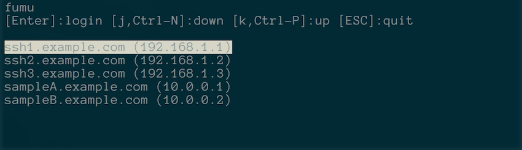

# fumu

## About
fumu is graphical selector of host for remote login. 

## Installation
    % go get -u github.com/malohithon/fumu

## Running
Configuration file is here.

	% cat fumu.conf
	ssh1.example.com       ssh  192.168.1.1
	ssh2.example.com       ssh  192.168.1.2
	ssh3.example.com       ssh  192.168.1.3
	sampleA.example.com    ssh  10.0.0.1
	sampleB.example.com    ssh  10.0.0.2

And then, 

    % fumu fumu.conf
